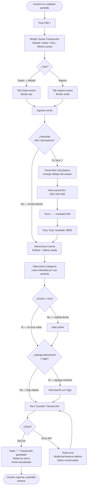
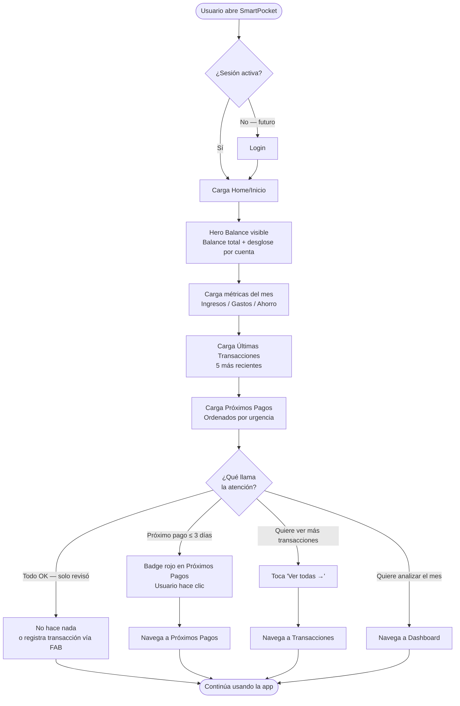
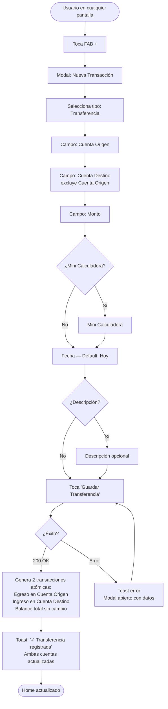
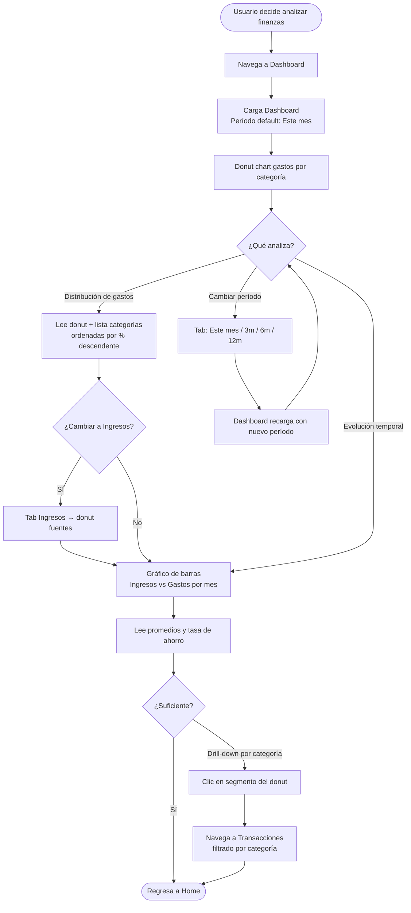
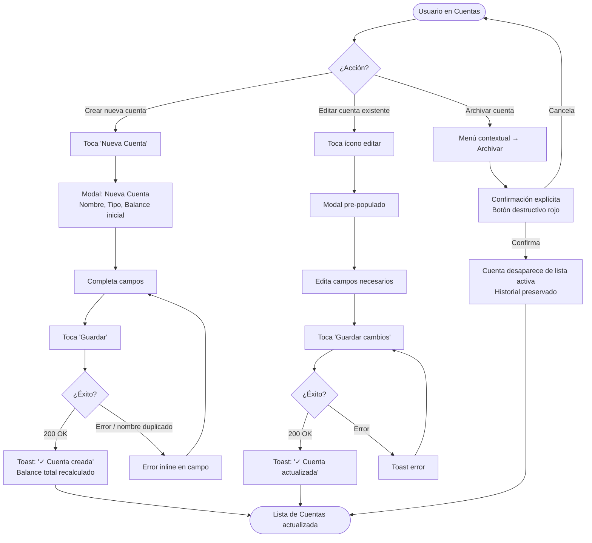

# UX Design Specification SmartPocket

**Author:** Chino
**Date:** 2026-02-28

---

## Executive Summary

### Project Vision

SmartPocket es una aplicación web de gestión financiera personal que prioriza velocidad de registro, control total de datos, y disponibilidad multi-dispositivo. El usuario construye su propia herramienta financiera con paridad funcional completa respecto a apps comerciales, pero sin anuncios, sin paywalls, y con libertad de evolucionar según necesidades específicas. El sistema de diseño está basado en dark mode con efectos glassmorphism, paleta de colores vibrante pero profesional, y tipografía Inter para legibilidad óptima.

### Target Users

**Usuario Único: Chino (Desarrollador-Usuario)**

- Desarrollador que construye su propia herramienta financiera
- Hábito establecido de registro financiero: 2-15 transacciones diarias
- Maneja múltiples cuentas (principal + ahorro + posibles fondos de inversión)
- Uso híbrido intenso: Desktop durante jornada laboral, Mobile cuando está fuera de casa
- Patrón de uso: Registro inmediato/diario + Revisión analítica bimestral/mensual
- Criterio de adopción: Paridad funcional 100% → desinstalación inmediata de app comercial
- Tolerancia cero a fricciones: registrar transacción <30 segundos es KPI crítico

### Key Design Challenges

1. **Velocidad de Registro como Prioridad Absoluta**
   - Competir contra app comercial requiere flujo ultra-rápido
   - Minimizar clics, campos obligatorios solo los esenciales
   - Campos mínimos: monto, fecha, cuenta, categoría
   - Campos opcionales: descripción, tags
   - Target: completar registro en <30 segundos

2. **Calculadora Inline sin Romper Flujo**
   - Feature diferenciador: sumar componentes de gastos compuestos (galletas + dulce de leche + jugo = monto final)
   - UX: Mini-calculadora en modal/segmento dentro del formulario de transacción
   - Activación: botón visible pero no intrusivo
   - Resultado: inserción automática del cálculo al campo monto
   - Debe ser intuitiva y no agregar fricción al flujo base

3. **Balance Multi-Cuenta Consolidado**
   - Usuario maneja múltiples cuentas (2-N cuentas activas)
   - Balance total = suma de todas las cuentas activas
   - Necesidad: ver balance consolidado rápido + acceso a desglose individual
   - Selección de cuenta en transacciones debe ser rápida y clara

4. **Responsive sin Disparidad Funcional**
   - App web responsive: misma funcionalidad desktop + mobile
   - Desktop: sidebar navigation, formularios posiblemente horizontales, tablas completas
   - Mobile: bottom navigation, formularios verticales, cards adaptativas
   - Decisión pragmática: si alguna funcionalidad necesita ajuste en mobile, evaluarlo en contexto
   - No crear "versión limitada" mobile deliberadamente

5. **Arquitectura de Información: Operacional vs Analítico**
   - **Inicio (Home)**: Vista operacional rápida
     - Balance consolidado
     - Transacciones recientes (últimas 5-10)
     - Próximos pagos pendientes
     - Acceso rápido a acciones frecuentes (Nueva Transacción, Transferencias)
   - **Dashboard (Análisis)**: Vista analítica con reportes
     - Gráficos de gastos por categoría
     - Evolución temporal ingresos/gastos
     - Métricas y reportes detallados
   - Esta separación refleja patrón de uso real: consultas diarias vs análisis periódico

6. **Gestión de Categorías como Configuración**
   - CRUD disponible pero no es flujo frecuente
   - Setup inicial con categorías por defecto sugeridas
   - UX: accesible desde sidebar pero re-priorizado (con separador visual después de features más frecuentes)

### Design Opportunities

1. **Calculadora como Ventaja Competitiva**
   - Apps comerciales no tienen calculadora inline bien resuelta
   - Oportunidad de crear UX memorable y útil
   - Caso de uso real: sumar compras múltiples sin cambiar de app
   - Implementación: Mini-calculadora activada por botón dentro del modal de transacción
   - Potencial de extensión futura: conversión de monedas, porcentajes, propinas

2. **Dark Mode Profesional desde Día 1**
   - Sistema de diseño basado en glassmorphism ya implementado
   - Paleta vibrante: Primary Blue (#3b82f6), Success Green (#10b981), Accent Purple (#a855f7), Danger Red (#ef4444), Warning Orange (#f59e0b)
   - Efectos glow en números financieros, depth en cards
   - Light mode como Growth Feature post-MVP (no bloqueante)

3. **Home como "Command Center" Operacional**
   - Separación Inicio/Dashboard es decisión estratégica
   - Home optimizado para velocidad: FAB para nueva transacción, acceso directo a operaciones frecuentes
   - Balance siempre visible, próximos pagos como recordatorios contextuales
   - Micro-interacciones: balance que se actualiza con animación suave, contador de días para próximos pagos

4. **Feature-First Architecture Aplicado a UX**
   - Cada módulo (Accounts, Categories, Transactions) como sección independiente
   - Navegación clara por features, no por abstracciones
   - Consistencia en patrones: modal forms, skeleton loaders, error handling
   - Escalabilidad: agregar features sin reestructurar navegación completa

5. **Micro-Interactions Financieras**
   - Balance con animación counter al actualizarse
   - Estados de carga con skeleton screens consistentes (ya implementado en AccountCardSkeleton)
   - Badges de estado para próximos pagos (días restantes, recurrencia)
   - Toast notifications centralizadas para feedback inmediato
   - Transiciones suaves entre vistas sin perder contexto

---

## Core User Experience

### Defining Experience

La experiencia central de SmartPocket gira alrededor de **registrar transacciones con la menor fricción posible**. Esta es la acción más frecuente (2-15 veces al día) y define el valor del producto. El usuario no está constantemente comprando o registrando ingresos - hay días de actividad alta (días de pago) y días de actividad baja, pero cuando necesita registrar, debe ser instantáneo.

**Acción Core:** Formulario de transacción con Mini Calculadora

- Entrada de datos rápida con campos mínimos obligatorios
- Capacidad de sumar componentes de gastos compuestos sin salir del flujo
- Feedback visual inmediato (balance actualizado)

**Filosofía:** "Es básicamente la entrada de cada día" - ni más complejo de lo necesario, ni más simple de lo útil.

### Platform Strategy

**Plataforma:** Web App Responsive

- Desktop (primary): Durante jornada laboral, acceso completo con mouse/keyboard
- Mobile (contextual): Fuera de casa, interfaz touch-optimized
- Sin disparidad funcional entre plataformas - ambas permiten todas las operaciones

**Conectividad:**

- Asume conexión a internet siempre disponible
- No se requiere funcionalidad offline en MVP
- Operaciones sincrónicas con feedback inmediato

**Consideraciones Técnicas:**

- Desktop: Sidebar navigation, formularios con layout optimizado, tablas completas
- Mobile: Bottom navigation (o hamburger menu), formularios verticales, cards adaptativas
- Atajos de teclado NO son primordiales en MVP (requieren definición cuidadosa para evitar conflictos con browser)

### Effortless Interactions

Áreas donde la interacción debe ser completamente natural y sin fricción:

1. **Abrir Nueva Transacción**
   - FAB (Floating Action Button) siempre visible en Home
   - 1 clic → modal de transacción abierto
   - Atajos de teclado: Post-MVP (requieren mapeo sin conflictos)

2. **Selección de Cuenta**
   - Dropdown con iconos + colores personalizados (consistente con AccountCard actual)
   - Ordenamiento definido por usuario (requerimiento funcional)
   - Smart default: última cuenta usada o cuenta principal

3. **Selección de Categoría**
   - Ordenamiento establecido por usuario (requerimiento funcional core)
   - Iconos visuales para identificación rápida
   - Categorías frecuentes accesibles sin scroll excesivo

4. **Campo Fecha**
   - Default automático: HOY
   - Date picker rápido para ajustar si es transacción de días anteriores

5. **Mini Calculadora**
   - Botón visible en formulario de transacción
   - Click → abre mini-calculadora con botones tradicionales (+, -, ×, ÷)
   - Resultado se inserta automáticamente al campo monto
   - Inspiración: apps existentes con calculadora integrada (no inventar rueda)

6. **Balance Actualizado**
   - Sin necesidad de refresh manual
   - Animación suave al cambiar valor (counter effect)
   - Confirmación visual de operación exitosa

### Critical Success Moments

Momentos make-or-break que determinan adopción o rechazo:

1. **Primera Transacción Registrada Rápidamente (<30s)**
   - Momento "Aha!": "Es más rápido que la app comercial sin anuncios"
   - Si este flujo falla o tiene fricción, todo el producto falla
   - Benchmark: competir directo con app comercial actual

2. **Primera Vez Usando Mini Calculadora**
   - Caso de uso: compra de merienda (galletas 200 + dulce de leche 100 + jugo 300)
   - Flujo: Click botón calculadora → [200] [+] [100] [+] [300] [=] → 600 insertado a monto
   - Momento memorable: "Ninguna app hace esto tan fácil"

3. **Ver Balance Consolidado Actualizado**
   - Nueva transacción guardada → Balance total se actualiza inmediatamente
   - Feedback visual instantáneo = confianza en el sistema
   - Balance = suma de todas las cuentas activas (principal + ahorro + fondos)

4. **Consulta Rápida desde Home**
   - Abrir app → ver últimas 5-10 transacciones sin navegación adicional
   - Validación rápida: "¿Qué gasté hoy/esta semana?"
   - Próximos pagos visibles como recordatorios contextuales

5. **Dashboard Analítico que Revela Patrones**
   - Primera vez entrando a Dashboard → gráficos muestran realidad financiera
   - Momento de reflexión: "Ahora entiendo exactamente dónde va mi dinero"
   - Uso no frecuente (bimestral/mensual) pero altamente valioso

### Experience Principles

Principios guía para todas las decisiones de diseño UX:

1. **"Velocidad Y Versatilidad"**
   - Registrar transacciones debe ser rápido (<30s target)
   - PERO sin sacrificar capacidades necesarias (tags, descripción opcional, mini calculadora)
   - Campos opcionales son opcionales de verdad (no obstaculizan flujo rápido)
   - Smart defaults reducen fricción (fecha=hoy, última cuenta usada)

2. **"Mini Calculadora como Feature Diferenciador"**
   - Calculadora tradicional en miniatura (botones +, -, ×, ÷)
   - Basarse en apps existentes que lo hacen bien - no inventar rueda
   - Siempre accesible pero nunca invasiva (botón visible, modal on-demand)
   - Caso de uso claro: sumar componentes de gastos compuestos

3. **"Balance Siempre Visible y Actualizado"**
   - Estado financiero actual en todo momento (Home siempre muestra balance)
   - Balance consolidado = suma de todas las cuentas activas
   - Feedback visual inmediato al registrar transacciones (animación counter)
   - Confianza = ver el cambio reflejado instantáneamente

4. **"Arquitectura: Operacional vs Analítico"**
   - **Inicio (Home):** Command center para acciones diarias (balance, recientes, próximos, FAB)
   - **Dashboard:** Vista analítica para reflexión periódica (gráficos, reportes, tendencias)
   - No mezclar flujos frecuentes con análisis profundo
   - Separación clara por frecuencia de uso

5. **"Responsive Funcional, No Limitado"**
   - Mobile no es "versión light" - es la app completa
   - Adaptar layout por espacio de pantalla, nunca remover funcionalidad
   - Decisiones pragmáticas en contexto (si algo necesita ajuste, evaluar caso por caso)
   - Desktop y Mobile son plataformas de igual importancia

6. **"Basarse en Patrones Probados"**
   - No reinventar soluciones ya resueltas (mini calculadora, date pickers, dropdowns)
   - Inspirarse en apps existentes que funcionan bien
   - Innovar donde agrega valor real, no por novedad
   - Filosofía: "funciona bien primero, optimiza después"

---

## Desired Emotional Response

### Primary Emotional Goals

**Alegría por Logro Personal**

- SmartPocket no compite con apps comerciales - es una app funcional propia
- Emoción principal: satisfacción de tener "mi primera app funcional"
- No se trata de ser mejor que otros, sino de tener control total y herramienta personalizada
- Orgullo técnico: arquitectura limpia, stack moderno, proyecto completo end-to-end

**Eficiencia Pragmática**

- Registrar transacciones rápido y continuar con otras actividades
- Target: 20 segundos desde abrir formulario hasta confirmación guardada
- Sin drama, sin emociones fuertes - solo fluidez operacional
- "Lo registré, listo, paso a otra cosa"

**Confianza en Funcionamiento**

- Balance actualizado correctamente = sistema confiable
- Confirmación visual inmediata de operaciones exitosas
- Sin ansiedad sobre "¿se guardó?" o "¿está correcto?"

**Utilidad Analítica**

- Dashboard permite ver más allá de listados simples
- Capacidad de condensar información, comparar, identificar patrones
- Valor en insights, no solo en data cruda

### Emotional Journey Mapping

**Descubrimiento/Primera Impresión:**

- Emoción: Alegría y orgullo personal
- Contexto: "Mi primera app funcional completa"
- NO hay competencia con apps comerciales - es un logro propio
- Satisfacción de construcción, no de comparación

**Durante Registro de Transacción (Core Action):**

- Emoción: Eficiencia sin fricción
- Experiencia deseada: "Registrar rápido y seguir adelante"
- Métrica: <20 segundos desde apertura de formulario hasta confirmación
- Sin emociones fuertes - solo pragmatismo funcional

**Uso de Mini Calculadora:**

- Emoción: Ninguna especial - pragmatismo puro
- Funcionalidad útil: sumar/restar sin salir de la app
- Operaciones pequeñas, contextuales
- No es un "wow moment" - es una herramienta práctica

**Ver Balance Actualizado:**

- Emoción: Confianza en correcto funcionamiento
- Validación: "Funciona OK"
- Feedback visual confirma operación exitosa
- Sistema confiable = usuario tranquilo

**Revisar Dashboard Analítico:**

- Emoción: Utilidad por insights
- Valor: condensar información, comparar datos
- Más allá de listados simples - análisis real
- Uso periódico pero altamente valioso

### Micro-Emotions

**Emociones a Generar:**

- ✅ **Orgullo técnico:** "Construí esto yo mismo"
- ✅ **Eficiencia operacional:** "Listo en segundos, sin fricción"
- ✅ **Confianza funcional:** "Funciona correctamente, sin bugs"
- ✅ **Claridad analítica:** "Entiendo mis finanzas mejor"
- ✅ **Control total:** "Mis datos, mi código, mis reglas"

**Emociones a Evitar:**

- ❌ **Ansiedad:** Confirmaciones claras eliminan dudas
- ❌ **Frustración:** Flujos rápidos, sin pasos innecesarios
- ❌ **Impaciencia:** Sin anuncios, sin delays artificiales
- ❌ **Confusión:** Interfaces claras, feedback explícito

### Design Implications

**Si queremos... Entonces diseñamos...**

1. **Eficiencia Pragmática** → Formularios minimalistas con smart defaults, FAB siempre visible, <20s target, feedback instantáneo

2. **Confianza Funcional** → Toast confirmations, balance con animación counter, estados de carga claros (skeletons), error handling explícito

3. **Utilidad Analítica** → Dashboard con gráficos significativos, comparaciones temporales, condensación inteligente de información

4. **Control Total** → Ordenamiento personalizable (cuentas, categorías), categorías custom, extensibilidad futura

5. **Ausencia de Fricción** → Mini calculadora modal on-demand (no invasiva), campos opcionales realmente opcionales, navegación directa

### Emotional Design Principles

1. **"Pragmatismo sobre Drama"**
   - No crear emociones artificiales donde no son necesarias
   - Mini calculadora es herramienta útil, no feature sorpresa
   - Diseño funcional antes que diseño emocional
   - "Funciona bien" es suficiente satisfacción

2. **"Confirmación sin Ansiedad"**
   - Feedback visual inmediato para todas las operaciones
   - Toast notifications centralizadas
   - Balance actualizado con animación suave
   - Estados de carga claros (skeletons)
   - Nunca dejar al usuario preguntándose "¿funcionó?"

3. **"Eficiencia es Respeto"**
   - Registrar transacción <20s es target no negociable
   - Cada segundo cuenta en flujos frecuentes
   - Smart defaults reducen decisiones
   - Sin pasos redundantes o confirmaciones innecesarias

4. **"Orgullo Técnico Justificado"**
   - Primera app funcional completa es logro real
   - Arquitectura limpia visible en código y UX
   - No competir con otros - celebrar logro personal
   - Diseño que refleja capacidad técnica

5. **"Utilidad sobre Novedad"**
   - Features que resuelven necesidades reales
   - Dashboard analítico con insights valiosos
   - Mini calculadora para operaciones contextuales
   - No agregar complejidad por innovar

---

## UX Pattern Analysis & Inspiration

### Inspiring Products Analysis

**Gestor de Gastos - Finanzas (Referencia Principal / App Actual)**

App actualmente en uso, razón principal para construir SmartPocket. No es la más visualmente impactante pero destaca por simplicidad y funcionalidad concreta.

- **Zero-friction home screen:** Gráfico de torta visible apenas abre → el usuario comprende su situación financiera sin navegar a ningún lugar
- **Categorías ordenadas por porcentaje:** Mayor gasto = mayor visibilidad → priorización automática de información relevante
- **Tabs Ingresos/Gastos:** Alternancia rápida entre vistas del mismo dato sin navegación adicional
- **Simplicidad sobre belleza:** Funcionalidad primero, estética secundaria → filosofía alineada con SmartPocket
- **Anti-ejemplo:** Anuncios intrusivos y paywalls → razón directa de reemplazo

**Wallet**

- Cards de cuentas con identidad visual (íconos, colores personalizados) → patrón ya implementado en SmartPocket
- Visualización de cuentas múltiples con balance individual y consolidado
- Timeline de transacciones clara, navegable, agrupada por fecha
- UI visualmente rica sin sacrificar usabilidad

**Revolut**

- **Monto como protagonista:** Campo grande y centrado en formulario de transacción
- Dashboard con métricas rápidas (balance, gastos del mes)
- Micro-animaciones al confirmar operaciones → confianza visual
- Formularios ultra-simplificados con defaults inteligentes

### Transferable UX Patterns

**Patrones de Navegación:**

- Tabs Ingresos/Gastos en Dashboard analítico (Gestor de Gastos) → vista unificada con contexto switcheable
- Sidebar desktop + adaptación mobile (SmartPocket ya tiene sidebar implementado)
- Agrupación de transacciones por fecha (hoy, ayer, esta semana) → contextualización temporal

**Patrones de Formulario de Transacción:**

- Monto como protagonista visual: campo grande, prominente, numérico (Revolut)
- Categorías ordenadas según configuración del usuario → frecuencia de uso guía el orden visual
- Fecha default = hoy con date picker accesible pero no invasivo
- Mini Calculadora: panel/modal que emerge con botones tradicionales (+, -, ×, ÷), botón "Usar resultado" inserta valor al campo monto

**Patrones de Dashboard Analítico:**

- Gráfico de torta prominente al entrar a la sección analítica (Gestor de Gastos)
- Lista de categorías debajo del gráfico, ordenadas por porcentaje decreciente
- Tabs de período: mes actual, últimos 3/6/12 meses
- Tabs Ingresos/Gastos para alternar contexto

**Patrones de Lista de Transacciones:**

- Agrupadas por fecha con label claro (Hoy, Ayer, fecha específica)
- Ítem conciso: ícono de categoría + descripción + monto + cuenta
- Sin información redundante o clutter

### Anti-Patterns to Avoid

- **Anuncios e interrupciones:** Causa raíz del abandono de app comercial → ninguna interrupción publicitaria
- **Acción core enterrada en navegación profunda:** Registrar transacción debe ser accesible en 1 clic desde cualquier pantalla (FAB)
- **Formularios con campos obligatorios innecesarios:** Descripción y tags son opcionales de verdad
- **Dashboard como pantalla de inicio:** Separar home operacional (diario) de análisis periódico
- **Categorías sin orden coherente:** El orden visual en formularios debe reflejar configuración del usuario
- **Monto como campo secundario:** Es el dato central de una transacción → debe ser protagonista visual
- **Feedback de operación tardío o ausente:** Nunca dejar al usuario preguntándose si la acción fue exitosa

### Design Inspiration Strategy

**Adoptar directamente:**

- Gráfico de torta + lista de categorías por porcentaje decreciente → Dashboard analítico de SmartPocket
- Tabs Ingresos/Gastos → sección analítica
- Cards de cuentas con identidad visual → ya implementado
- Monto como campo protagonista en formulario de transacción
- Timeline de transacciones agrupada por fecha

**Adaptar:**

- Dashboard de Revolut → simplificar al contexto personal (sin métricas bancarias complejas)
- Timeline de Wallet → agregar filtros y búsqueda según requerimientos de SmartPocket
- Mini calculadora de apps existentes → integrar como modal on-demand en formulario de transacción
- Tabs de período (mes/3m/6m/12m) → adaptar a necesidades de análisis bimestral del usuario

**Evitar:**

- Cualquier patrón que agregue fricción al registro de transacciones
- Vistas sin skeleton loaders durante carga (ya resuelto parcialmente)
- Navegación que requiera más de 2 taps para llegar al formulario de nueva transacción
- Modales anidados o flujos complejos para operaciones simples

---

## Design System Foundation

### Design System Choice

**Sistema:** Themeable System — Tailwind CSS v4 + shadcn/ui

Proyecto brownfield con stack UI ya elegido e implementado. La decisión se mantiene: no cambiar lo que ya funciona.

### Rationale for Selection

- Stack ya configurado y funcionando con módulo de Cuentas completo al 100%
- Tailwind CSS v4 con `@theme` y formato `oklch` ofrece theming flexible sin configuración extra
- shadcn/ui + Radix UI proveen accesibilidad built-in, componentes probados, y copiad directa al proyecto
- Filosofía del proyecto: "funciona bien primero" → no reinventar rueda con sistema nuevo
- Glassmorphism dark mode ya establecido en design-preview-2.html como referencia visual

### Implementation Approach

**Estado Actual del Stack:**

| Capa                 | Tecnología                               | Estado          |
| -------------------- | ---------------------------------------- | --------------- |
| Estilos              | Tailwind CSS v4 (`@theme`, `oklch`)      | ✅ Implementado |
| Componentes base     | shadcn/ui + Radix UI                     | ✅ Implementado |
| Iconos               | Heroicons + Lucide React                 | ✅ Implementado |
| Notificaciones       | Sonner (toasts)                          | ✅ Implementado |
| Tema visual          | Dark mode glassmorphism                  | ✅ Definido     |
| Tipografía           | Inter (300-800 weights)                  | ✅ Definido     |
| Librería de gráficos | A definir (Recharts / Chart.js / Tremor) | 🔲 Pendiente    |

**Paleta de Color Establecida:**

- 🔵 Primary `#3b82f6` → Interacciones & Confianza
- 🟢 Success `#10b981` → Ingresos & Crecimiento
- 🔴 Danger `#ef4444` → Gastos & Alertas
- 🟡 Warning `#f59e0b` → Límites & Precaución
- 🟣 Accent `#a855f7` → Énfasis secundario

### Customization Strategy

**Componentes Custom a Implementar** (no existen en shadcn/ui, requieren desarrollo propio):

1. **Mini Calculadora**
   - Modal/panel on-demand con botones tradicionales (+, -, ×, ÷)
   - Botón de activación visible en formulario de transacción
   - Botón "Usar resultado" inserta valor calculado al campo monto
   - Inspiración: calculadoras integradas en apps financieras existentes

2. **FAB (Floating Action Button) — Nueva Transacción**
   - Botón flotante visible en todas las pantallas
   - Acción: abrir modal de nueva transacción
   - Posición: bottom-right (convención estándar)
   - Prioridad visual clara sin obstaculizar contenido

3. **Bottom Navigation (Mobile)**
   - Barra de navegación inferior para pantallas móviles
   - Alternativa al sidebar en viewport pequeño
   - Items: Inicio, Transacciones, Cuentas, Dashboard, más (⋯)

4. **Separador Visual en Sidebar**
   - Distinción entre features frecuentes (Inicio, Transacciones, Cuentas, Próximos Pagos, Dashboard) y configuración (Categorías, Configuración)
   - Línea divisora + reducción de prominencia visual en items menos frecuentes

**Decisión Pendiente:**

- Librería de gráficos: evaluar Recharts (mejor integración con shadcn/ui), Chart.js, Tremor antes de implementar Dashboard analítico

---

## Core User Experience

### Defining Experience

La experiencia definidora de SmartPocket es:

> **"Registrar una transacción financiera en menos de 20 segundos, con posibilidad de sumar componentes del gasto sin salir de la app"**

Todo lo demás del producto sirve a esta experiencia central. Si este flujo es rápido y confiable, SmartPocket cumple su propósito principal.

### User Mental Model

- El usuario ya sabe lo que quiere registrar **antes** de abrir el formulario
- El formulario no descubre información → **confirma** datos que ya tiene en mente
- Smart defaults reducen decisiones al mínimo
- La Mini Calculadora es para casos específicos (compras múltiples), no el flujo base
- Patrones familiares = curva de aprendizaje cero

### Success Criteria

| Criterio                               | Target                                        |
| -------------------------------------- | --------------------------------------------- |
| Tiempo de registro (flujo básico)      | < 20 segundos                                 |
| Número de clics para guardar           | ≤ 4 (FAB → monto → categoría → guardar)       |
| Feedback de confirmación post-guardado | < 1 segundo                                   |
| Balance actualizado en Home            | Inmediato (TanStack Query cache invalidation) |

### Novel UX Patterns

**Patrón:** Establecido con variación propia

- Formulario modal: patrón establecido (Wallet, Gestor de Gastos, Revolut)
- Campos mínimos con opcionales disponibles: patrón establecido
- Tabs Gasto/Ingreso para cambio de tipo: patrón común en apps financieras
- **Mini Calculadora integrada en formulario: variación propia** sobre patrón de modal
- Sin patrones truly novel → reduce curva de aprendizaje a cero

### Experience Mechanics

**1. Iniciación**

- FAB visible en todas las pantallas (bottom-right)
- 1 clic → modal de nueva transacción abierto
- Sin navegación previa requerida

**2. Formulario de Transacción**

```
[Tab: Gasto | Tab: Ingreso]           ← tipo seleccionable como tabs

[Monto]       [_________] [Calc 🔢]   ← campo protagonista + botón Mini Calc
[Cuenta]      [Cuenta Principal ▾]    ← dropdown con ícono/color, smart default
[Categoría]   [Comida ▾]              ← dropdown con ícono, orden configurado
[Fecha]       [Hoy, 01/03/2026 ▾]    ← default hoy, date picker accesible
[Descripción] [Opcional...    ]       ← campo libre opcional
[Tags]        [+ agregar tag  ]       ← chips editables opcionales

              [Cancelar] [Guardar ✓]
```

**3. Flujo Mini Calculadora (activación on-demand)**

Layout: calculadora estándar 4×5 (referencia: Gestor de Gastos app)

```
[  C  ] [ +/- ] [  %  ] [  ÷  ]
[  7  ] [  8  ] [  9  ] [  ×  ]
[  4  ] [  5  ] [  6  ] [  -  ]
[  1  ] [  2  ] [  3  ] [  +  ]
[  ,  ] [  0  ] [ ⌫  ] [ [=] ]
```

- Botón `=` con color Primary Blue destacado (referencia: botón amarillo del Gestor de Gastos)
- Display superior muestra operación en curso y resultado
- Botón **"Usar resultado"** inserta el valor calculado al campo monto y cierra la calculadora
- Implementación: panel/segmento que emerge dentro o debajo del modal de transacción

**4. Completado**

- Click "Guardar" → toast ✅ "Transacción registrada"
- Modal se cierra automáticamente
- Balance en Home se actualiza con animación counter suave
- Transacción aparece en lista de recientes

---

## Visual Design Foundation

### Color System

**Tema Base:** Dark mode permanente (MVP). Light mode como Growth Feature post-MVP.

**Backgrounds (Capas de Profundidad):**

| Capa          | Uso                           | Valor                              |
| ------------- | ----------------------------- | ---------------------------------- |
| bg-base       | Fondo de página               | `#0f172a` (slate-900)              |
| bg-surface    | Cards, modales, sidebar       | `rgba(30,41,59,0.6)` glassmorphism |
| bg-elevated   | Dropdowns, tooltips, popovers | `rgba(30,41,59,0.8)`               |
| border-subtle | Separadores, bordes de cards  | `rgba(148,163,184,0.1)`            |
| border-medium | Bordes de inputs, cards hover | `rgba(148,163,184,0.2)`            |

**Paleta Semántica:**

| Token          | Color   | Hex                   | Uso                                          |
| -------------- | ------- | --------------------- | -------------------------------------------- |
| primary        | Blue    | `#3b82f6`             | Botones primarios, links, FAB, foco          |
| success        | Emerald | `#10b981`             | Ingresos, valores positivos, confirmaciones  |
| danger         | Red     | `#ef4444`             | Gastos, valores negativos, errores, eliminar |
| warning        | Amber   | `#f59e0b`             | Próximos pagos pendientes, límites           |
| accent         | Purple  | `#a855f7`             | Transferencias, énfasis secundario           |
| text-primary   | White   | `#f8fafc` (slate-50)  | Títulos, valores principales                 |
| text-secondary | Slate   | `#94a3b8` (slate-400) | Labels, metadata, subtextos                  |
| text-muted     | Slate   | `#475569` (slate-600) | Placeholders, texto deshabilitado            |

**Color Semántico para Transacciones:**

| Tipo                   | Color                  | Lógica                           |
| ---------------------- | ---------------------- | -------------------------------- |
| Gasto                  | `danger` #ef4444       | Dinero que sale                  |
| Ingreso                | `success` #10b981      | Dinero que entra                 |
| Transferencia          | `accent` #a855f7       | Movimiento entre cuentas propias |
| Próximo pago pendiente | `warning` #f59e0b      | Compromiso futuro                |
| Balance total          | `text-primary` #f8fafc | Dato neutral de estado           |

**Efectos Visuales:**

- Glassmorphism: `backdrop-filter: blur(16-20px)` en cards, sidebar, modales
- Glow en números financieros importantes: `text-shadow` sutil con el color del dato
- Gradientes sutiles en backgrounds de section: `from-slate-900 via-slate-800 to-slate-900`
- Hover states: `translateY(-2px)` en cards interactivas

### Typography System

**Fuente:** Inter (ya instalada vía Google Fonts)

| Rol        | Size                | Weight                 | Uso                               |
| ---------- | ------------------- | ---------------------- | --------------------------------- |
| Display    | `text-4xl` (36px)   | `font-extrabold` (800) | Balance total principal           |
| Heading 1  | `text-2xl` (24px)   | `font-bold` (700)      | Títulos de sección                |
| Heading 2  | `text-xl` (20px)    | `font-semibold` (600)  | Subtítulos, nombres de card       |
| Body Large | `text-base` (16px)  | `font-medium` (500)    | Contenido principal, labels       |
| Body       | `text-sm` (14px)    | `font-normal` (400)    | Textos secundarios, descripciones |
| Caption    | `text-xs` (12px)    | `font-normal` (400)    | Metadata, timestamps, badges      |
| Monospace  | `font-mono text-sm` | -                      | Montos en tablas, código          |

**Reglas de Legibilidad:**

- Montos financieros: siempre `font-mono` para alineación vertical en listas
- Números grandes (balance): `number-glow` con `text-shadow` sutil
- Line-height: `leading-relaxed` (1.625) para texto de lectura, `leading-tight` para números

### Spacing & Layout Foundation

**Base Unit:** 4px (escala Tailwind estándar)

**Espaciado de Componentes:**

| Contexto            | Padding                     | Uso                             |
| ------------------- | --------------------------- | ------------------------------- |
| Cards principales   | `p-6` (24px) o `p-8` (32px) | Financial cards, modales        |
| Items de lista      | `px-4 py-3` (16px/12px)     | Nav items, transaction rows     |
| Botones principales | `px-6 py-3` (24px/12px)     | Acciones primarias              |
| Inputs              | `px-4 py-2` (16px/8px)      | Campos de formulario            |
| Badges/chips        | `px-3 py-1` (12px/4px)      | Tags, estados                   |
| Gap entre cards     | `gap-6` (24px)              | Grids de cards                  |
| Gap interno         | `space-y-4` (16px)          | Elementos dentro de formularios |

**Layout Grid:**

- Desktop: Sidebar fijo (w-64) + main content fluid
- Financial cards dashboard: `grid grid-cols-1 md:grid-cols-2 lg:grid-cols-3`
- Formularios: single column, max-width contenida (`max-w-md` en modal)
- Densidad: moderadamente espaciosa (balance entre información densa y respiración visual)

**Radios de Borde:**

- Cards grandes: `rounded-2xl` (16px) o `rounded-3xl` (24px)
- Botones: `rounded-xl` (12px)
- Inputs: `rounded-lg` (8px)
- Badges/chips: `rounded-full`
- Botones de calculadora: `rounded-xl` (12px)

### Accessibility Considerations

**MVP (Requerimiento Bloqueante):**

- Navegación completa por teclado (Tab, Shift+Tab, Enter, Escape)
- Focus visible en todos los elementos interactivos (`ring-2 ring-blue-500`)
- Labels asociados a todos los inputs del formulario
- Contraste mínimo: texto primario (#f8fafc) sobre bg-surface pasa WCAG AA

**Contraste de Color Crítico:**

- Montos en danger red sobre dark bg: ratio ~4.8:1 (pasa WCAG AA)
- Montos en success green sobre dark bg: ratio ~4.5:1 (pasa WCAG AA)
- Text-secondary (slate-400) sobre bg-base: ratio ~4.6:1 (pasa WCAG AA nivel mínimo)

**Post-MVP:**

- ARIA labels completos
- Screen reader support
- WCAG AA compliance total
- High contrast mode

---

## Design Direction Decision (Step 9)

**Decisión:** Combinar (C) — Base aprobada con refinamientos pendientes

**Artefacto generado:** `_docs/planning-artifacts/ux-design-directions.html` (6 mockups interactivos)

### Decisiones Aprobadas

| Elemento               | Decisión                                                                     | Estado                               |
| ---------------------- | ---------------------------------------------------------------------------- | ------------------------------------ |
| Home layout            | **Hero Balance** (Dirección A) — balance consolidado como elemento dominante | ✅ Aprobado                          |
| Formulario transacción | Tabs Gasto/Ingreso, monto protagonista, campos opcionales al final           | ✅ Aprobado con posibles ajustes     |
| Mini Calculadora       | Layout 4×5 estándar, botón `=` accent Blue, panel integrado en modal         | ✅ Aprobado con posibles ajustes     |
| Dashboard analítico    | Donut chart + categorías por % + gráfico barras Ingresos vs Gastos           | ✅ Aprobado con posibles extensiones |
| Mobile navigation      | Bottom nav 5 items + FAB posicionado sobre la barra                          | ✅ Aprobado                          |

### Refinamientos Pendientes

1. **Posición de Dashboard en sidebar:** Potencialmente debe ir antes de Cuentas dado que el usuario lo usa más frecuentemente. A decidir en Step 10 con los flujos de uso real.
2. **Calibración visual contra app real:** Los mockups usan valores inline. Ajustar en implementación contrastando con `webapp/src/` y Tailwind v4 `@theme`/`oklch()` existentes.
3. **Identidad visual propia:** Evitar el patrón glassmorphism genérico (azul-verde sobre `#0f172a`) reconocible como AI-generated. Refinar con características propias de SmartPocket.
4. **Formularios adicionales:** Diseño de formularios Crear/Editar Cuentas y Categorías pendiente — evaluar durante Step 11 o implementación de esos módulos.
5. **Contenido exacto del Dashboard analítico:** KPIs y métricas específicas a confirmar cuando el módulo se implemente.

### Nota Metodológica

Los steps siguientes (User Journeys, Component Specs) **no dependen de que el diseño visual esté finalizado**. Las decisiones de píxeles se calibran en implementación real. Lo que documenta este spec son los **patrones de interacción y arquitectura de información**, que sí están definidos y aprobados.

---

## User Journey Flows

### Journey 1 — Registrar Transacción

**Frecuencia:** 2-4 veces diarias (semana laboral), hasta 15 el día de pagos.
**Meta:** Registrar en < 20 segundos con el mínimo de fricciones.
**Entry points:** FAB (cualquier pantalla).



**Optimizaciones de flujo:**

- **Smart defaults:** Tipo=Gasto, Fecha=Hoy, Cuenta=última usada → 0 decisiones en el caso más frecuente
- **Campos opcionales al final:** Descripción y tags nunca bloquean el flujo rápido
- **Error recovery sin pérdida de datos:** Si la API falla, el modal no se cierra ni limpia el formulario
- **Mini Calculadora no invasiva:** Solo aparece bajo demanda, no estorba el flujo básico

---

### Journey 2 — Llegada y Revisión del Home

**Frecuencia:** Diaria, cada vez que abre la app.
**Meta:** En 3 segundos saber el estado financiero y qué requiere atención.



**Patrones de información:**

- El Home **no requiere interacción** — su valor primario es informativo
- Urgencia de Próximos Pagos: rojo (< 3 días), amarillo (4-7 días), gris (> 7 días) — reemplaza notificaciones push

---

### Journey 3 — Registrar Transferencia entre Cuentas

**Frecuencia:** 1-2 veces al mes.
**Meta:** Registrar movimiento de dinero entre cuentas propias sin afectar el balance total.



**Regla de negocio clave:** Una transferencia genera dos transacciones (egreso + ingreso); el balance total del sistema no cambia. Se muestra con ícono 🔄 y color púrpura para distinguirla.

---

### Journey 4 — Consultar Dashboard Analítico

**Frecuencia:** Bimestral/mensual.
**Meta:** Entender distribución de gastos por categoría y evolución temporal.



---

### Journey 5 — Gestión de Cuentas

**Frecuencia:** Setup inicial + ediciones esporádicas.
**Meta:** Crear/editar cuentas con nombre, tipo y balance inicial correcto.



---

### Patrones de Journey Identificados

**Patrón Modal con Smart Defaults:**
Todos los formularios de creación abren en modal con valores pre-completados. El usuario solo interviene en lo que difiere del caso típico (Gasto, Hoy, última cuenta usada).

**Patrón FAB como Entry Point Universal:**
El FAB (+) es el único punto de entrada para acciones de creación en todas las pantallas. Elimina la necesidad de recordar dónde está el botón según la sección.

**Patrón Toast + Modal Persistente:**

- Éxito: toast ✓ + modal se cierra automáticamente
- Error: toast de error + modal permanece abierto con datos intactos

**Patrón de Navegación Contextual:**
El Home actúa como hub situacional: cada elemento es clickeable y lleva al contexto relevante (transacción reciente → detalle, pago próximo → módulo pagos).

**Patrón Destructivo con Confirmación:**
Acciones irreversibles (archivar, eliminar) siempre requieren confirmación explícita con botón en rojo.

---

### Principios de Optimización de Flujo

1. **Cero pasos obligatorios antes del valor:** Home carga datos sin interacción del usuario.
2. **Defecto = caso más frecuente:** El 80% de registros no requiere cambiar ningún default.
3. **Progresividad:** Campos opcionales siempre al final. La descripción nunca bloquea el guardado.
4. **Recuperación sin pérdida:** Errores de API conservan el estado del formulario.
5. **Señales visuales como guías:** Colores en Próximos Pagos reemplazan notificaciones intrusivas.
6. **Acciones destructivas con fricción intencional:** Confirmaciones explícitas para archivar/eliminar.

---

## Component Strategy

### Design System Components (shadcn/ui)

**Componentes ya instalados — usar directamente:**

- `Dialog` — modal de Nueva Transacción, Nueva Cuenta, confirmaciones destructivas
- `Select` — dropdowns de Cuenta, Categoría; selector de período en Dashboard
- `Form` + React Hook Form + Zod v4 — todos los formularios con validación
- `Badge` — indicadores de urgencia en Próximos Pagos, etiqueta de tipo de transacción
- `Skeleton` — estados de carga en Home, Dashboard, listas de transacciones
- `Sonner` — todos los toasts (éxito, error, info) — ya configurado en `main.tsx`

**Componentes a instalar (requeridos por journeys):**

| Componente     | Comando                              | Usado en                                           |
| -------------- | ------------------------------------ | -------------------------------------------------- |
| `Tabs`         | `npx shadcn@latest add tabs`         | Gasto/Ingreso en formulario, períodos en Dashboard |
| `Separator`    | `npx shadcn@latest add separator`    | Separador visual en sidebar                        |
| `Popover`      | `npx shadcn@latest add popover`      | Date picker en formulario de transacción           |
| `Calendar`     | `npx shadcn@latest add calendar`     | Combinado con Popover para selección de fecha      |
| `Tooltip`      | `npx shadcn@latest add tooltip`      | Íconos sidebar en estado compacto (futuro)         |
| `Alert Dialog` | `npx shadcn@latest add alert-dialog` | Confirmación para archivar/eliminar                |

---

### Custom Components

#### 1. `FloatingActionButton` (FAB)

**Propósito:** Entry point universal para crear nueva transacción desde cualquier pantalla.

**Estados:**

| Estado         | Visual                              |
| -------------- | ----------------------------------- |
| Default        | `bg-blue-600`, sombra con glow azul |
| Hover          | `scale-110`, sombra amplificada     |
| Active/pressed | `scale-95`                          |
| Mobile         | `bottom: 72px` (sobre Bottom Nav)   |
| Desktop        | `bottom: 32px`, `right: 32px`       |

**Props:**

```tsx
interface FABProps {
  onClick: () => void;
  label?: string; // aria-label — default: "Nueva Transacción"
  className?: string;
}
```

---

#### 2. `MiniCalculator`

**Propósito:** Panel de cálculo on-demand para sumar ítems antes de ingresar el monto.

**Estados:**

| Estado        | Descripción                           |
| ------------- | ------------------------------------- |
| Cerrado       | No renderizado (condicional)          |
| Abierto vacío | Display muestra `0`                   |
| Con expresión | Línea superior: `200 + 100 + 300`     |
| Con resultado | Botón "Usar resultado: $X" habilitado |
| Error (div/0) | Display: `Error`, limpiar con C       |

**Props:**

```tsx
interface MiniCalculatorProps {
  onResult: (value: number) => void; // callback al campo monto
  onClose: () => void;
}
```

**Interacción:** `=` calcula y activa botón "Usar resultado". Click llama `onResult(value)` y cierra el panel.

---

#### 3. `TransactionTypeTab`

**Propósito:** Selector visual Gasto / Ingreso / Transferencia en el formulario de transacción.

**Estados por tab:**

| Tab           | Color activo                                                     |
| ------------- | ---------------------------------------------------------------- |
| Gasto         | `text-red-400` / `border-red-500/30` / fondo rojo tenue          |
| Ingreso       | `text-emerald-400` / `border-emerald-500/30` / fondo verde tenue |
| Transferencia | `text-purple-400` / `border-purple-500/30` / fondo púrpura tenue |

**Nota:** Al cambiar a Transferencia, el formulario adapta sus campos (Cuenta Origen + Cuenta Destino reemplazan Categoría).

---

#### 4. `BalanceHeroCard`

**Propósito:** Tarjeta principal del Home que muestra el balance consolidado como elemento dominante.

**Props:**

```tsx
interface BalanceHeroCardProps {
  totalBalance: number;
  accounts: Array<{ name: string; balance: number }>;
  monthlyVariation: number; // porcentaje
  currency?: string; // default: 'ARS'
}
```

---

#### 5. `UpcomingPaymentRow`

**Propósito:** Fila individual de pago próximo con indicador de urgencia visual.

**Variantes de urgencia (por `daysUntilDue`):**

| Días     | Badge    | Estilo                                   |
| -------- | -------- | ---------------------------------------- |
| ≤ 3 días | rojo     | `border-red-500/20` / `bg-red-500/8`     |
| 4–7 días | amarillo | `border-amber-500/20` / `bg-amber-500/8` |
| > 7 días | gris     | `border-slate-500/10` / `bg-slate-500/5` |

---

#### 6. `SidebarNav` (actualización del componente existente)

**Cambios requeridos sobre `webapp/src/layout/Sidebar.tsx`:**

- Renombrar "Dashboard" → "Inicio" (ruta `ROUTES.HOME`)
- Agregar "Próximos Pagos" (ruta `ROUTES.UPCOMING_PAYMENTS`)
- Renombrar "Reportes" → "Dashboard" (ruta `ROUTES.DASHBOARD`)
- Agregar `Separator` antes de "Categorías" y "Configuración"
- **Orden final:** Inicio → Cuentas → Transacciones → Próximos Pagos → `Separator` → Dashboard → `Separator` → Categorías → Configuración

---

### Component Implementation Strategy

**Principio:** Todos los custom components usan tokens del `@theme` de Tailwind v4 existente. Cero valores hardcodeados en inline styles.

**Estructura de archivos propuesta:**

```
webapp/src/components/
├── ui/                          ← componentes shadcn (no modificar)
├── common/
│   ├── FloatingActionButton.tsx
│   ├── MiniCalculator.tsx
│   └── UpcomingPaymentRow.tsx
└── features/
    ├── transactions/
    │   └── TransactionTypeTab.tsx
    └── home/
        └── BalanceHeroCard.tsx
```

---

### Implementation Roadmap

**Fase 1 — Críticos (bloquean flujo principal):**

1. `FloatingActionButton` — entry point de la acción más frecuente
2. `MiniCalculator` — feature diferenciadora del formulario
3. `TransactionTypeTab` — visual Gasto/Ingreso/Transferencia
4. `SidebarNav` update — navegación correcta antes de cualquier módulo nuevo
5. Instalar `Tabs`, `Separator`, `AlertDialog`

**Fase 2 — Importantes (completan el Home):** 6. `BalanceHeroCard` — pieza central del Inicio 7. `UpcomingPaymentRow` — widget de Próximos Pagos 8. Instalar `Popover` + `Calendar` — date picker en formulario

**Fase 3 — Mejoras (post-MVP):** 9. `Tooltip` — sidebar compacto 10. Bottom Navigation component — mobile

---

## UX Consistency Patterns

### Iconografía

**Librería:** Heroicons v2 (ya instalado) como librería principal. Lucide React como secundaria para íconos no disponibles en Heroicons.

**Regla:** Nunca usar emojis como íconos funcionales en la UI final — solo en empty states de forma decorativa y en contenido de datos (emoji de categoría elegido por el usuario). Todos los íconos de navegación, acciones y feedback usan componentes SVG de Heroicons/Lucide.

**Tamaños estándar:**

| Contexto                 | Tamaño           | Ejemplo                          |
| ------------------------ | ---------------- | -------------------------------- |
| Navegación sidebar       | 20px (`size-5`)  | `HomeIcon`, `CreditCardIcon`     |
| Botones con ícono        | 16px (`size-4`)  | `PlusIcon` en FAB                |
| Input prefix/suffix      | 16px (`size-4`)  | `CalendarIcon` en fecha          |
| Empty states decorativos | 48px (`size-12`) | `BanknotesIcon`                  |
| Toast                    | 16px (`size-4`)  | `CheckCircleIcon`, `XCircleIcon` |

---

### Button Hierarchy

Toda acción tiene un peso visual único y consistente en toda la app.

| Nivel           | Uso                                                                 | Estilo                                                  |
| --------------- | ------------------------------------------------------------------- | ------------------------------------------------------- |
| **Primary**     | Acción principal del contexto (Guardar transacción, Guardar cuenta) | `bg-blue-600 text-white` — máximo 1 por modal/pantalla  |
| **Secondary**   | Acción alternativa (Cancelar, Volver)                               | `border border-slate-600 bg-transparent text-slate-300` |
| **Destructive** | Eliminar, Archivar                                                  | `bg-red-600 text-white` — solo dentro de `AlertDialog`  |
| **Ghost**       | Acciones de bajo peso (Ver todas →, filtros)                        | `text-blue-400 bg-transparent` — sin borde              |
| **FAB**         | Crear transacción (acción global)                                   | Circular `bg-blue-600` — siempre visible, posición fija |

**Reglas:**

- Nunca dos botones Primary en el mismo nivel de jerarquía
- El botón destructivo solo aparece precedido de confirmación explícita (`AlertDialog`)
- En formularios: Primary (Guardar) a la derecha, Secondary (Cancelar) a la izquierda
- En mobile: Secondary ocupa 1/3 del ancho, Primary ocupa 2/3

---

### Feedback Patterns

**Toast (Sonner) — 3 variantes:**

| Tipo     | Trigger                   | Duración                    | Ícono                        |
| -------- | ------------------------- | --------------------------- | ---------------------------- |
| ✅ Éxito | Operación completada      | 3 segundos                  | `CheckCircleIcon` verde      |
| ❌ Error | Fallo de API o validación | 5 segundos + dismiss manual | `XCircleIcon` rojo           |
| ℹ️ Info  | Acción informativa        | 3 segundos                  | `InformationCircleIcon` azul |

**Posición:** `bottom-right` en desktop, `bottom-center` en mobile (para no tapar el FAB).

**Inline validation (formularios):**

- Errores de Zod: aparecen bajo el campo afectado, `text-red-400` + `ExclamationTriangleIcon`
- Validación: `onBlur` — nunca mientras el usuario escribe
- El botón Primary no se deshabilita durante escritura (solo si hay errores Zod activos al submit)

**Estados de carga:**

- Listas y datos: `Skeleton` de shadcn — mismo tamaño y forma que el contenido real
- Botón durante submit: spinner inline (`ArrowPathIcon` animado) + texto "Guardando..." + `disabled`
- Transición: fade-in suave al cargar datos

---

### Form Patterns

**Layout:**

- Label → Input → Error inline (si aplica)
- Campos obligatorios marcados con `*` en el label
- Campos opcionales con texto `(opcional)` en label, color atenuado
- Agrupación: campos core primero, opcionales al final

**Input states:**

| Estado   | Visual                                       |
| -------- | -------------------------------------------- |
| Default  | `border-slate-700/50 bg-slate-900/60`        |
| Focus    | `ring-2 ring-blue-500/50 border-blue-500/40` |
| Error    | `border-red-500/50 ring-2 ring-red-500/20`   |
| Disabled | `opacity-50 cursor-not-allowed`              |

**Dropdowns:** siempre muestran el valor actual con ícono contextual (Heroicons de categoría, cuenta). Nunca texto genérico "Seleccionar..." si hay un default disponible.

**Date picker:** campo con `CalendarIcon` de Heroicons, abre `Popover` + `Calendar`. Default: hoy. Formato: "Hoy, 01 de marzo 2026" (desktop) / "01/03/2026" (mobile).

---

### Navigation Patterns

**Desktop (Sidebar fijo):**

- Ítem activo: `bg-blue-500/15` + `text-blue-400` + borde izquierdo `border-l-2 border-blue-500`
- Ítem inactivo: `text-slate-400`, hover `bg-slate-700/40`
- `Separator` de shadcn entre bloque principal y bloque de configuración

**Mobile (Bottom Navigation):**

- 5 ítems: Inicio, Transacciones, Cuentas, Dashboard, Más (⋯)
- Íconos: Heroicons `HomeIcon`, `BanknotesIcon`, `CreditCardIcon`, `ChartBarIcon`, `EllipsisHorizontalIcon`
- FAB flotante sobre la barra (`bottom: 72px`)
- "Más" abre sheet/drawer con: Próximos Pagos, Categorías, Configuración

---

### Modal y Overlay Patterns

**Dialog (formularios):**

- `max-w-md` en desktop, pantalla completa en mobile
- Header: título + botón `XMarkIcon` (esquina superior derecha)
- Cierre: botón ✕, tecla Escape, clic en backdrop — **excepto** si hay datos sin guardar

**AlertDialog (acciones destructivas):**

- No cierra con Escape ni clic en backdrop
- Título claro: "¿Archivar Cuenta Principal?"
- Botón destructivo en rojo, botón cancelar secundario

**Mini Calculadora:**

- Panel inline dentro del Dialog de transacción (no es un Dialog anidado)
- Se cierra con "Usar resultado" o con segundo clic en botón calculadora (`CalculatorIcon`)

---

### Empty States

Todo listado sin datos muestra un empty state coherente — nunca lista vacía sin contexto.

| Pantalla       | Ícono Heroicons             | Mensaje                          | CTA                                           |
| -------------- | --------------------------- | -------------------------------- | --------------------------------------------- |
| Transacciones  | `ClipboardDocumentListIcon` | "Sin transacciones aún"          | "Registrar primera transacción"               |
| Cuentas        | `CreditCardIcon`            | "Sin cuentas"                    | "Crear primera cuenta"                        |
| Próximos Pagos | `BellIcon`                  | "Sin pagos próximos registrados" | —                                             |
| Dashboard      | `ChartBarIcon`              | "Sin datos suficientes"          | "Registrá transacciones para ver el análisis" |

**Patrón visual:** ícono 48px + título + descripción + CTA opcional. Centrado verticalmente en el área del contenido.

---

### Loading States

**Regla:** Nunca pantalla en blanco. Siempre `Skeleton` mientras los datos cargan.

| Elemento                 | Skeleton                        |
| ------------------------ | ------------------------------- |
| `BalanceHeroCard`        | Rectángulo alto, ancho completo |
| Lista de transacciones   | 5 filas con forma de `tx-row`   |
| Cards de métricas (Home) | 3 rectángulos en grilla         |
| Donut chart (Dashboard)  | Círculo + lista de items        |

Transición: datos reales aparecen con `animate-fade-in` (150ms) al resolver la query de TanStack Query.

---

### Search y Filtering Patterns

**Filtros en lista de transacciones:** período, tipo (Gasto/Ingreso/Transferencia), cuenta, categoría, búsqueda por texto.

**Patrón visual:** chips/badges filtrables sobre la lista. Activos: `bg-blue-500/20 border-blue-500/40`. Chip `XMarkIcon` + "Limpiar filtros" cuando hay filtros activos.

**Conteo:** "Mostrando 12 de 47 transacciones" cuando hay filtros activos.

---

## Responsive Design & Accessibility

### Responsive Strategy

**Principio:** Mobile-first CSS — pantallas pequeñas definen la base, breakpoints superiores la expanden.

| Dispositivo               | Layout                         | Formularios                  | Navegación              |
| ------------------------- | ------------------------------ | ---------------------------- | ----------------------- |
| **Desktop** (`>1024px`)   | Sidebar fijo 224px + contenido | Modales `max-w-md` centrados | Sidebar fijo            |
| **Tablet** (`768–1024px`) | Sidebar colapsable (hamburger) | Modales `max-w-md`           | Sidebar drawer temporal |
| **Mobile** (`<768px`)     | Full width, 1 columna          | Pantalla completa            | Bottom Navigation       |

---

### Breakpoint Strategy

Breakpoints estándar de Tailwind v4 (ya configurados en el proyecto):

| Token    | Ancho      | Cambio principal                    |
| -------- | ---------- | ----------------------------------- |
| _(base)_ | `< 768px`  | Bottom Nav, formularios full-screen |
| `md:`    | `≥ 768px`  | Sidebar drawer, grillas 2 columnas  |
| `lg:`    | `≥ 1024px` | Sidebar fijo, modales centrados     |
| `xl:`    | `≥ 1280px` | Márgenes más generosos              |

**Approach en código:** clases responsive de Tailwind (`md:grid-cols-2 lg:grid-cols-3`). Sin media queries CSS manuales salvo casos excepcionales.

---

### Accessibility Strategy

**Nivel objetivo:** WCAG 2.1 AA.

**MVP (bloqueante para release):**

| Requisito              | Implementación                                                 |
| ---------------------- | -------------------------------------------------------------- |
| Navegación por teclado | Tab/Shift+Tab/Enter/Escape en todos los interactivos           |
| Focus visible          | `focus-visible:ring-2 focus-visible:ring-blue-500`             |
| Labels en inputs       | `htmlFor` + `id`; `aria-label` en íconos sin texto             |
| Contraste mínimo       | Texto `#f8fafc` sobre bg-surface: ≥ 4.5:1 ✅                   |
| Touch targets          | Mínimo 44×44px en mobile                                       |
| Semántica HTML         | `<nav>`, `<main>`, `<dialog>`, `<button>` correctos            |
| ARIA en modales        | `role="dialog"` + `aria-labelledby` (incluido en Radix/shadcn) |
| Mensajes de error      | `aria-describedby` vinculando input con error Zod              |

**Post-MVP:** `aria-live` para actualizaciones dinámicas, skip links, testing con screen reader.

---

### Testing Strategy

- **Responsive:** Chrome DevTools device emulation durante desarrollo; validación real en mobile al terminar cada módulo
- **Accesibilidad:** Axe DevTools (extensión Chrome) en audits periódicos; navegación manual por teclado antes de cada release
- **Contraste:** WebAIM Contrast Checker al definir colores
- **Performance:** LCP < 2.5s; lazy load de Dashboard/gráficos; `Skeleton` visible en < 50ms

---

### Implementation Guidelines

```tsx
// Mobile-first responsive
<div className="grid grid-cols-1 md:grid-cols-2 lg:grid-cols-3 gap-4">

// Sidebar visible solo en desktop
<aside className="hidden lg:flex w-56 flex-col">

// Modal adaptable
<DialogContent className="max-w-full lg:max-w-md h-full lg:h-auto">

// FAB accesible
<button aria-label="Nueva Transacción">
  <PlusIcon className="size-6" aria-hidden="true" />
</button>

// Input con label y error vinculados
<label htmlFor="amount">Monto *</label>
<input id="amount" aria-describedby="amount-error" />
<p id="amount-error" className="text-red-400">…</p>

// Íconos decorativos invisibles para screen readers
<HomeIcon className="size-5" aria-hidden="true" />
```

---
